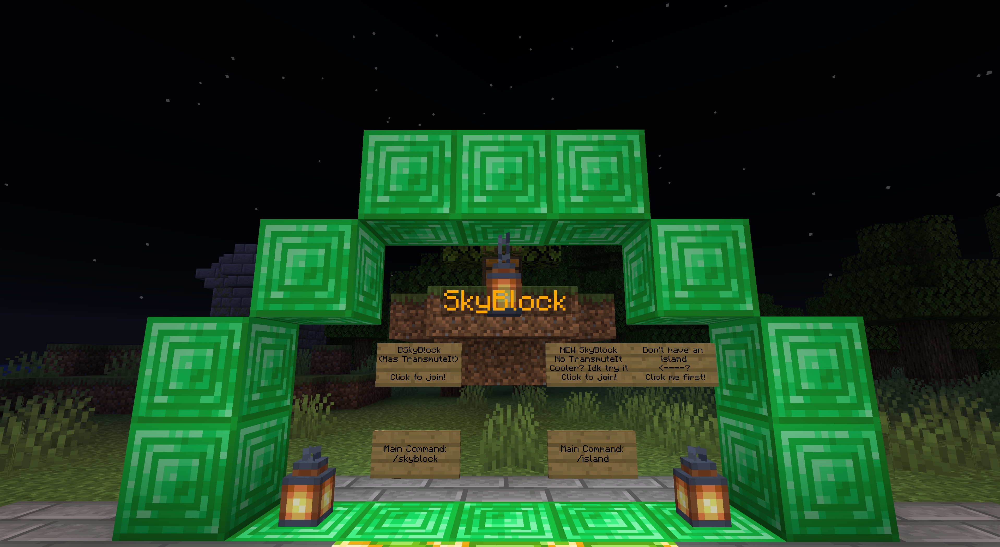
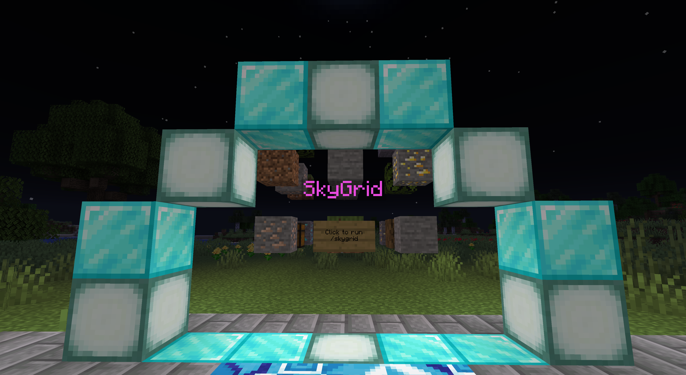
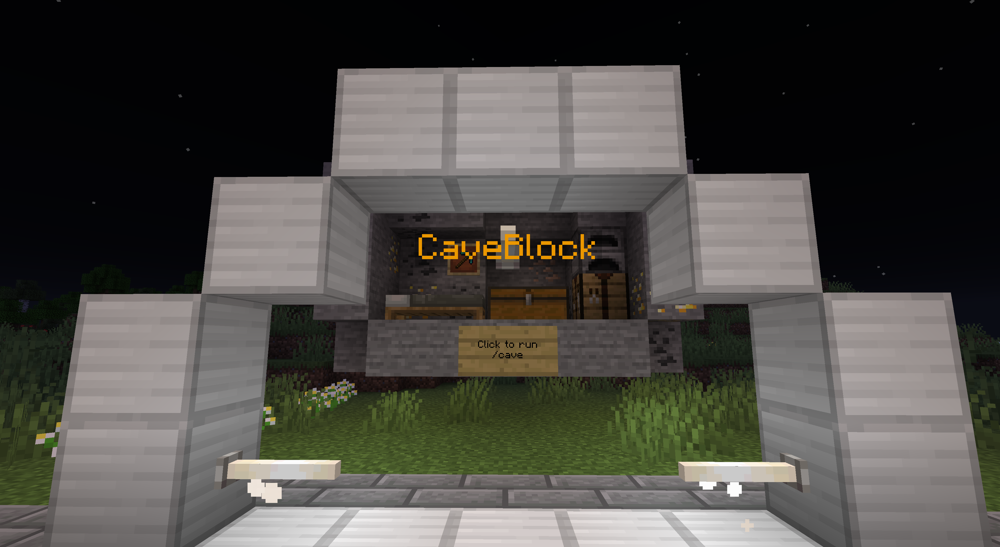
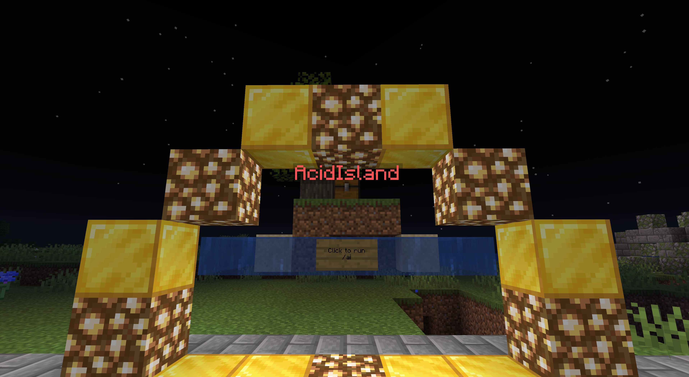
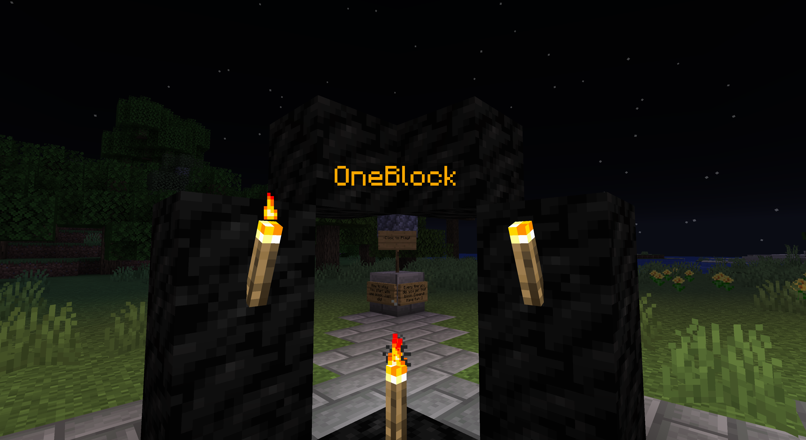

Welcome to Memerator Skyblock documentation!

We offer 5 types of gamemodes on Memerator Skyblock

## Skyblock

Skyblock is your classic every day Skyblock.

We offer 2 types of Skyblock on MemeratorMC. One uses BentoBox's BSkyBlock, and allows support for Transmuting items. The other gamemode is FabledSkyblock, and does not allow Transmuting. Transmuting is only allowed in the first skyblock world.

[Click here to learn more about Skyblock!](skyblock)

## SkyGrid

SkyGrid is your classic every day SkyGrid. A map originally inspired by SethBling.

[Click here to learn more about SkyGrid!](skygrid)

## CaveBlock

CaveBlock is inspired by "StoneBlock" modpack, where you have your own little cave to dig around in. As it's boring without mods, the world is now a Mountains biome Buffet world with the Cave preset. This makes exploration 100% more fun instead of just being an endless stone nothingness.

[Click here to learn more about CaveBlock!](caveblock)

## AcidIsland

AcidIsland is similar to Skyblock. However, you're not in the sky, you're on an island in the middle of an "acid" ocean. Stepping in the acid will start to burn you after a little bit. Rain is also acid, look out for that.

[Click here to learn more about AcidIsland!](acidisland)

## OneBlock

OneBlock is just one block, or is it? Mining this block will yield itself, and plant itself anew. Keep mining and building, and you'll level up!

[Click here to learn more about OneBlock!](oneblock)
